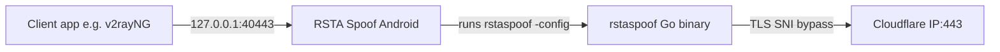
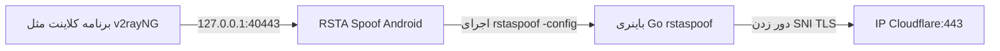

# RSTA Spoof — Android

A Jetpack Compose app that manages multiple proxy profiles and runs the **rstaspoof** Go binary as a foreground service — with live logs and traffic stats in the notification.

This Android wrapper bundles and controls the upstream [rstaspoof](https://github.com/rstagit/rstaspoof) tool. The core SNI spoofing and TLS fragmentation logic lives in that Go project; this repo provides the mobile UI, profile storage, and service lifecycle.

---

## Acknowledgments

**Thank you to the author of the original Go script** — [rstagit/rstaspoof](https://github.com/rstagit/rstaspoof) (RSTA SNI Spoof v3.0.0).

This Android app would not exist without that work. All bypass techniques (SNI spoofing, TLS ClientHello fragmentation, TTL tricks, and real-time connection monitoring) come from the upstream `rstaspoof.go` project. This repository wraps that binary in a user-friendly Android experience.

For upstream CLI usage, Termux builds, and advanced flags, see the [rstaspoof README](https://github.com/rstagit/rstaspoof).


---

## Features

- **Multiple proxy profiles** — save, edit, and switch configs (Room database)
- **Foreground service** — persistent notification with Start/Stop and ↑/↓ traffic counters
- **Live logs** — terminal-style view with ANSI-colored stdout from the Go process
- **Bundled arm64 binary** — extracted from jniLibs with an assets/codeCache fallback
- **Bypass methods from upstream** — `fragment`, `fake_sni`, and `combined` (recommended)

### How it works



---

## Requirements

### For building (developers)

| Requirement | Version / notes |
|-------------|-----------------|
| **Go** | 1.22 or newer |
| **Android Studio** | Ladybug or newer recommended |
| **Android SDK** | compileSdk 35, minSdk 26, targetSdk 35 |
| **JDK** | 17 |
| **Device for testing** | Physical **arm64-v8a** phone (API 26+). x86 emulators are not supported unless you add an x86 Go build |
| **`local.properties`** | Copy from `local.properties.example` and set `sdk.dir` to your Android SDK path (Android Studio usually creates this automatically) |

The compiled arm64 binary is **gitignored**. You must run `./scripts/build-android.sh` before assembling an APK.

### For using (end users)

- Android 8.0+ (API 26+) on an **arm64** device
- A working **clean Cloudflare IP** for the SNI server IP field (scan and replace the default if connections fail)
- A client app that supports a local HTTP/SOCKS proxy (e.g. **v2rayNG**)

---

## Build

### Step 1 — Build the Go binary (required)

From the project root:

```bash
./scripts/build-android.sh
```

This script:

1. Cross-compiles `rstaspoof.go` for Android arm64:
   ```bash
   CGO_ENABLED=0 GOOS=android GOARCH=arm64 go build -ldflags="-s -w" \
     -o app/src/main/jniLibs/arm64-v8a/librstaspoof.so rstaspoof.go
   ```
2. Copies the same binary to `app/src/main/assets/rstaspoof` — a fallback copied into `codeCacheDir` at runtime when the native lib is not extracted.

Verify the output:

```bash
file app/src/main/jniLibs/arm64-v8a/librstaspoof.so
# Expected: ELF 64-bit LSB pie executable, ARM aarch64
```

> **Note:** Executing the binary from `filesDir` fails with **error=13** (permission denied). The app uses `nativeLibraryDir` or `codeCacheDir` instead.

### Step 2 — Build the Android app

**Android Studio**

1. Open this folder in Android Studio.
2. Sync Gradle.
3. Run on an arm64 device.

**Command line**

```bash
./gradlew assembleDebug
adb install -r app/build/outputs/apk/debug/app-debug.apk
```

For a release APK, run `./gradlew assembleRelease`. Release signing is not pre-configured in this repo; the debug path above is the primary workflow for local builds.

---

## Usage

### Quick start

1. **Install** the APK on an arm64 phone. Grant the notification permission when prompted.
2. **First launch** — a **Default** profile is created automatically:

   | Field | Default value |
   |-------|---------------|
   | Local IP | `0.0.0.0` |
   | Local port | `40443` |
   | SNI server IP | `104.19.229.21` |
   | SNI server port | `443` |
   | SNI website | `www.hcaptcha.com` |
   | Method | `combined` |

3. **Edit the config** if needed — replace **SNI server IP** with a clean Cloudflare IP that works on your network.
4. **Select** the profile, then tap the **Start** button (play FAB). The app writes a JSON config and runs:

   ```text
   rstaspoof -config /data/user/0/com.rstaspoof.app/files/proxy_run.json
   ```

5. **Configure your client app** (e.g. v2rayNG):
   - Set the proxy address to `127.0.0.1:40443`
   - Add **RSTA Spoof** to the per-app proxy / tunneled-apps list for apps that should use the local proxy

6. **Monitor** — open the **Logs** tab for live connection output. The notification shows upload/download bytes and a **Stop** action.

7. **Stop** the proxy before switching or editing profiles. The UI locks config changes while the service is running.

### Tabs

| Tab | Purpose |
|-----|---------|
| **Configs** | List, select, create, edit, and delete proxy profiles |
| **Logs** | Live stdout from the running rstaspoof process |

---

## Configuration reference

### UI fields → Go flags → JSON keys

| UI field | Go flag | JSON key (written at runtime) |
|----------|---------|----------------------------------|
| Local IP | `-listen` host | `LISTEN_HOST` |
| Local port | `-listen` port | `LISTEN_PORT` |
| SNI server IP | `-connect` host | `CONNECT_IP` |
| SNI server port | `-connect` port | `CONNECT_PORT` |
| SNI website | `-sni` | `FAKE_SNI` |
| Method | `-method` | `BYPASS_METHOD` |

After starting, point client apps at:

```text
127.0.0.1:<local port>
```

Default: `127.0.0.1:40443`

### Bypass methods

| Method | Description |
|--------|-------------|
| `fragment` | Splits the TLS ClientHello at the SNI field. Works without root. |
| `fake_sni` | Sends a fake SNI using a TTL trick. May be limited on Android without root. |
| `combined` | Uses both methods — **recommended default**. |

### Advanced flags (CLI only)

The Android UI does not expose these upstream flags today. Power users can refer to the [upstream rstaspoof docs](https://github.com/rstagit/rstaspoof) for:

- `-fragment-strategy` (`sni_split`, `half`, `multi`, `tls_record_frag`)
- `-fragment-delay`
- `-ttl-trick`
- `-quiet`, `-no-monitor`, `-info`

Equivalent CLI example (what the app does internally via JSON):

```bash
rstaspoof -listen 0.0.0.0:40443 -connect IP:443 -sni www.hcaptcha.com -method combined
```

---

## Troubleshooting

| Problem | What to try |
|---------|-------------|
| **"rstaspoof missing"** error | Run `./scripts/build-android.sh`, then rebuild and reinstall the APK |
| **Proxy won't start** | Ensure the Go binary was built; check Logs tab for details |
| **No connections / timeouts** | Try a different clean Cloudflare IP; use `combined` method |
| **`fake_sni` unreliable** | Android limits TTL injection without root; prefer `fragment` or `combined` |
| **Listener not visible** | While running: `adb shell netstat -tln \| grep 40443` |
| **x86 emulator** | Not supported out of the box; requires building an x86 Go binary and adding the ABI filter |

Traffic stats in the notification use `TrafficStats` for the app UID (includes the child rstaspoof process).

---

## Developer test checklist

- [ ] Binary builds as arm64 ELF (`file` command above)
- [ ] App starts; default config appears on first launch
- [ ] Start shows banner/listen lines in Logs
- [ ] `adb shell netstat -tln | grep <port>` shows listener while running
- [ ] Stop from notification ends the process
- [ ] Notification byte counters move under load
- [ ] Switching profile after stop starts with new arguments

---

---

# RSTA Spoof — اندروید

اپلیکیشن Jetpack Compose برای مدیریت چند پروفایل پروکسی و اجرای باینری Go **rstaspoof** به‌صورت سرویس foreground — با لاگ زنده و آمار ترافیک در نوتیفیکیشن.

این نسخه اندروید، ابزار upstream [rstaspoof](https://github.com/rstagit/rstaspoof) را بسته‌بندی و کنترل می‌کند. منطق اصلی جعل SNI و فرگمنتیشن TLS در پروژه Go قرار دارد؛ این مخزن UI موبایل، ذخیره پروفایل‌ها و مدیریت سرویس را فراهم می‌کند.

---

## تشکر و قدردانی

**از نویسنده اسکریپت Go اصلی تشکر می‌کنیم** — [rstagit/rstaspoof](https://github.com/rstagit/rstaspoof) (RSTA SNI Spoof v3.0.0).

بدون آن پروژه، این اپ اندروید وجود نداشت. تمام تکنیک‌های bypass (جعل SNI، فرگمنتیشن TLS ClientHello، ترفند TTL و مانیتور real-time اتصال‌ها) از پروژه upstream `rstaspoof.go` می‌آید. این مخزن آن باینری را در یک تجربه کاربری ساده اندروید قرار داده است.

برای استفاده CLI، بیلد Termux و فلگ‌های پیشرفته، [README پروژه rstaspoof](https://github.com/rstagit/rstaspoof) را ببینید.

**گروه پروژه:** [@rstasnispoof در تلگرام](https://t.me/rstasnispoof)

---

## ویژگی‌ها

- **چند پروفایل پروکسی** — ذخیره، ویرایش و تعویض تنظیمات (پایگاه Room)
- **سرویس foreground** — نوتیفیکیشن پایدار با Start/Stop و شمارنده ↑/↓ ترافیک
- **لاگ زنده** — نمای ترمینالی با خروجی رنگی ANSI از پروسه Go
- **باینری arm64 بسته‌بندی‌شده** — استخراج از jniLibs با fallback از assets/codeCache
- **روش‌های bypass از upstream** — `fragment`، `fake_sni` و `combined` (پیشنهادی)

### نحوه کار



---

## پیش‌نیازها

### برای بیلد (توسعه‌دهندگان)

| مورد | نسخه / توضیح |
|------|--------------|
| **Go** | ۱.۲۲ یا جدیدتر |
| **Android Studio** | Ladybug یا جدیدتر پیشنهاد می‌شود |
| **Android SDK** | compileSdk 35، minSdk 26، targetSdk 35 |
| **JDK** | ۱۷ |
| **دستگاه تست** | گوشی فیزیکی **arm64-v8a** (API 26+). شبیه‌ساز x86 پشتیبانی نمی‌شود مگر بیلد Go برای x86 اضافه کنید |
| **`local.properties`** | از `local.properties.example` کپی کنید و `sdk.dir` را تنظیم کنید |

باینری arm64 کامپایل‌شده **gitignore** است. قبل از assemble APK حتماً `./scripts/build-android.sh` را اجرا کنید.

### برای استفاده (کاربران)

- اندروید ۸.۰+ (API 26+) روی دستگاه **arm64**
- یک **IP تمیز Cloudflare** برای فیلد IP سرور SNI (در صورت قطع بودن، IP پیش‌فرض را با IP تمیز جایگزین کنید)
- برنامه کلاینت با پشتیبانی پروکسی محلی (مثلاً **v2rayNG**)

---

## نحوه بیلد

### مرحله ۱ — بیلد باینری Go (الزامی)

از ریشه پروژه:

```bash
./scripts/build-android.sh
```

این اسکریپت:

1. `rstaspoof.go` را برای Android arm64 کامپایل می‌کند
2. همان باینری را در `app/src/main/assets/rstaspoof` کپی می‌کند — fallback برای `codeCacheDir` در زمان اجرا

بررسی خروجی:

```bash
file app/src/main/jniLibs/arm64-v8a/librstaspoof.so
# انتظار: ELF 64-bit LSB pie executable, ARM aarch64
```

> **نکته:** اجرا از `filesDir` با **error=13** (permission denied) شکست می‌خورد. اپ از `nativeLibraryDir` یا `codeCacheDir` استفاده می‌کند.

### مرحله ۲ — بیلد اپ اندروید

**Android Studio**

1. این پوشه را در Android Studio باز کنید.
2. Gradle را Sync کنید.
3. روی دستگاه arm64 اجرا کنید.

**خط فرمان**

```bash
./gradlew assembleDebug
adb install -r app/build/outputs/apk/debug/app-debug.apk
```

---

## راهنمای استفاده

### شروع سریع

1. **نصب** APK روی گوشی arm64. اجازه نوتیفیکیشن را بدهید.
2. **اولین اجرا** — پروفایل **Default** خودکار ساخته می‌شود:

   | فیلد | مقدار پیش‌فرض |
   |------|----------------|
   | Local IP | `0.0.0.0` |
   | Local port | `40443` |
   | SNI server IP | `104.19.229.21` |
   | SNI server port | `443` |
   | SNI website | `www.hcaptcha.com` |
   | Method | `combined` |

3. **ویرایش تنظیمات** در صورت نیاز — **SNI server IP** را با IP تمیز Cloudflare جایگزین کنید.
4. **انتخاب** پروفایل، سپس دکمه **Start** (FAB پلی). اپ فایل JSON می‌نویسد و اجرا می‌کند:

   ```text
   rstaspoof -config /data/user/0/com.rstaspoof.app/files/proxy_run.json
   ```

5. **تنظیم برنامه کلاینت** (مثلاً v2rayNG):
   - آدرس پروکسی: `127.0.0.1:40443`
   - **RSTA Spoof** را در لیست per-app proxy / برنامه‌های تونل‌شده اضافه کنید

6. **مانیتور** — تب **Logs** برای خروجی زنده. نوتیفیکیشن بایت‌های up/down و دکمه **Stop** را نشان می‌دهد.

7. قبل از تعویض یا ویرایش پروفایل، پروکسی را **متوقف** کنید.

### تب‌ها

| تب | کاربرد |
|----|--------|
| **Configs** | لیست، انتخاب، ساخت، ویرایش و حذف پروفایل‌ها |
| **Logs** | خروجی زنده stdout از rstaspoof |

---

## مرجع تنظیمات

### فیلدهای UI → فلگ Go → کلید JSON

| فیلد UI | فلگ Go | کلید JSON |
|---------|--------|-----------|
| Local IP | `-listen` host | `LISTEN_HOST` |
| Local port | `-listen` port | `LISTEN_PORT` |
| SNI server IP | `-connect` host | `CONNECT_IP` |
| SNI server port | `-connect` port | `CONNECT_PORT` |
| SNI website | `-sni` | `FAKE_SNI` |
| Method | `-method` | `BYPASS_METHOD` |

بعد از استارت، در برنامه کلاینت آدرس پروکسی را روی:

```text
127.0.0.1:<local port>
```

تنظیم کنید. پیش‌فرض: `127.0.0.1:40443`

### روش‌های Bypass

| روش | توضیح |
|-----|-------|
| `fragment` | تقسیم ClientHello در محل SNI. بدون نیاز به روت |
| `fake_sni` | ارسال SNI جعلی با ترفند TTL. روی اندروید بدون روت محدود است |
| `combined` | ترکیب هر دو روش — **پیش‌فرض پیشنهادی** |

### فلگ‌های پیشرفته (فقط CLI)

UI اندروید این فلگ‌های upstream را فعلاً نشان نمی‌دهد. برای `-fragment-strategy`، `-fragment-delay`، `-ttl-trick` و غیره به [مستندات rstaspoof](https://github.com/rstagit/rstaspoof) مراجعه کنید.

---

## عیب‌یابی

| مشکل | راه‌حل |
|------|--------|
| خطای **"rstaspoof missing"** | `./scripts/build-android.sh` را اجرا کنید، APK را دوباره بیلد و نصب کنید |
| **پروکسی استارت نمی‌شود** | مطمئن شوید باینری Go بیلد شده؛ تب Logs را بررسی کنید |
| **اتصال برقرار نمی‌شود** | IP تمیز Cloudflare دیگری امتحان کنید؛ روش `combined` |
| **`fake_sni` ناپایدار** | TTL بدون روت روی اندروید محدود است؛ `fragment` یا `combined` |
| **listener دیده نمی‌شود** | در حین اجرا: `adb shell netstat -tln \| grep 40443` |
| **شبیه‌ساز x86** | out of the box پشتیبانی نمی‌شود |

---

## چک‌لیست تست توسعه‌دهنده

- [ ] باینری به‌صورت arm64 ELF بیلد می‌شود
- [ ] اپ استارت می‌شود؛ پروفایل پیش‌فرض در اولین اجرا ظاهر می‌شود
- [ ] Start خطوط banner/listen را در Logs نشان می‌دهد
- [ ] `adb shell netstat -tln | grep <port>` در حین اجرا listener را نشان می‌دهد
- [ ] Stop از نوتیفیکیشن پروسه را متوقف می‌کند
- [ ] شمارنده بایت نوتیفیکیشن تحت بار تغییر می‌کند
- [ ] تعویض پروفایل بعد از Stop با آرگومان‌های جدید استارت می‌شود

---

## لینک‌ها

- **Upstream Go project:** [github.com/rstagit/rstaspoof](https://github.com/rstagit/rstaspoof)
