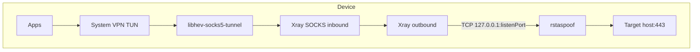

# SNI-Ray — Android

**SNI-Ray** is a single Android app that combines a **v2rayNG-style VPN** (Xray via [AndroidLibXrayLite](https://github.com/2dust/AndroidLibXrayLite)) with **rstaspoof** SNI bypass. You import servers, enable SNI bypass profiles, and tap one **Connect** button — no separate v2rayNG install and no per-app proxy whitelist for the bypass hop.

The app is based on a port of [v2rayNG](https://github.com/2dust/v2rayNG) (GPL-3.0) under `com.sniray.app.v2ray`, plus the upstream [rstaspoof](https://github.com/rstagit/rstaspoof) Go binary. See `LICENSE` and `THIRD_PARTY_NOTICES.md`.

---

## Acknowledgments

**Thank you to the author of the original Go script** — [rstagit/rstaspoof](https://github.com/rstagit/rstaspoof) (RSTA SNI Spoof v3.0.0).

SNI spoofing, TLS ClientHello fragmentation, TTL tricks, and connection monitoring come from that upstream project. The v2rayNG UI and VPN stack are adapted from [2dust/v2rayNG](https://github.com/2dust/v2rayNG).

- **rstaspoof docs:** [github.com/rstagit/rstaspoof](https://github.com/rstagit/rstaspoof)
- **Community:** [@rstasnispoof on Telegram](https://t.me/rstasnispoof)

---

## Features

| Area | What you get |
|------|----------------|
| **VPN** | Import VMess/VLESS/Trojan/etc., subscriptions, routing, per-app proxy, geo rules |
| **SNI bypass** | Room-backed profiles (`fragment`, `fake_sni`, `combined`) |
| **Unified connect** | FAB starts rstaspoof, waits for the local port, then starts Xray VPN with the server rewritten to loopback |
| **UI** | One home screen: bottom nav (Servers / Bypass / Logs) + drawer for v2ray settings |
| **Logs** | Live rstaspoof stdout on the Logs tab; VPN status via v2ray notifications |

---

## How it works

When **Chain SNI bypass with VPN** is on (Bypass tab) and **VPN mode** is enabled (drawer → Settings), connect does this:

1. **rstaspoof** listens on `127.0.0.1:<local port>` (default `40443`).
2. The selected v2ray profile’s server address is rewritten to `127.0.0.1:<port>` (raw TCP — not SOCKS).
3. **Xray** dials that loopback address; traffic is transformed by rstaspoof and sent to your target IP with SNI bypass.
4. **hev-socks5-tunnel** bridges the system TUN to Xray’s local SOCKS port.



Turn off the chain toggle to use v2ray with the server address unchanged (no rstaspoof hop). Proxy-only mode skips the rstaspoof bootstrap entirely.

---

## Requirements

| Requirement | Details |
|-------------|---------|
| **Device** | Android 8.0+ (API 26+), **arm64-v8a** (physical phone recommended) |
| **Permissions** | VPN, notifications (Android 13+) |
| **Network** | A working **clean Cloudflare IP** in the bypass profile if the default fails |
| **Settings** | **VPN mode** on (not proxy-only) for chained bypass |

---

## Usage

### Quick start

1. Install the APK on an arm64 device. Allow notifications when asked.
2. **Servers** (bottom nav) — add or import a server; tap to select it.
3. **Bypass** (bottom nav) — keep **Chain SNI bypass with VPN** enabled; select a profile (a **Default** profile is created on first launch).
4. Tap the **Connect** FAB (on any tab). Grant VPN permission if prompted.
5. **Logs** (bottom nav) — watch rstaspoof output while connected.
6. Stop via the FAB or the VPN / proxy notification **Stop** action.

### Bottom navigation

| Tab | Purpose |
|-----|---------|
| **Servers** | Server list, groups/subscriptions, import (QR, clipboard, manual) |
| **Bypass** | SNI profiles, chain toggle, add/edit/delete |
| **Logs** | Terminal-style rstaspoof logs |

### Navigation drawer (☰)

| Item | Purpose |
|------|---------|
| Subscriptions | Subscription URLs and updates |
| Per-app proxy | Include/exclude apps from VPN |
| Routing | Custom routing rules |
| Geo assets | `geoip.dat` / `geosite.dat` |
| Settings | VPN vs proxy-only, DNS, SOCKS, hev tunnel options |
| Logcat | Xray/core log viewer |
| Backup / restore | Configuration backup |
| About | Version and core info |

---

## Bypass configuration

### UI fields → runtime JSON

| UI field | JSON key | Typical default |
|----------|----------|-----------------|
| Local IP | `LISTEN_HOST` | `0.0.0.0` |
| Local port | `LISTEN_PORT` | `40443` |
| SNI server IP | `CONNECT_IP` | `104.19.229.21` (replace with a clean IP) |
| SNI server port | `CONNECT_PORT` | `443` |
| SNI website | `FAKE_SNI` | `www.hcaptcha.com` |
| Method | `BYPASS_METHOD` | `combined` |

Equivalent upstream CLI:

```bash
rstaspoof -listen 0.0.0.0:40443 -connect IP:443 -sni www.hcaptcha.com -method combined
```

### Bypass methods

| Method | Description |
|--------|-------------|
| `fragment` | Splits TLS ClientHello at the SNI field (no root). |
| `fake_sni` | Fake SNI via TTL trick; often limited on Android without root. |
| `combined` | Both — **recommended**. |

Advanced upstream flags (`-fragment-strategy`, `-ttl-trick`, etc.) are not exposed in the UI; see the [rstaspoof README](https://github.com/rstagit/rstaspoof).

---

## Project layout

```text
android/
├── app/
│   ├── libs/libv2ray.aar          # Xray bindings (download or build)
│   ├── src/main/
│   │   ├── java/com/sniray/app/
│   │   │   ├── v2ray/             # v2rayNG port (VPN, UI, handlers)
│   │   │   ├── rsta/              # SNI bypass bootstrap + config injection
│   │   │   ├── service/           # ProxyForegroundService (rstaspoof)
│   │   │   └── v2ray/ui/          # MainActivity, bypass/logs fragments, drawer screens
│   │   └── java/com/v2ray/ang/service/
│   │       └── TProxyService.kt   # JNI anchor for libhev-socks5-tunnel
│   └── jniLibs/arm64-v8a/         # librstaspoof.so, libhev-socks5-tunnel.so
├── AndroidLibXrayLite/            # git submodule (optional local AAR build)
├── hev-socks5-tunnel/              # git submodule (optional local hev build)
├── rstaspoof.go                    # upstream Go source (bundled as .so)
└── scripts/                        # native build helpers
```

---

## Build from source

### Toolchain

| Tool | Version / notes |
|------|-----------------|
| **Go** | 1.22+ (for `rstaspoof`) |
| **Android Studio** | Recent stable (Ladybug+) |
| **Android SDK** | compileSdk 35, minSdk 26, targetSdk 35 |
| **JDK** | 17 |
| **NDK** | For building `libhev-socks5-tunnel.so` (optional if using `fetch-libhev.sh`) |
| **`local.properties`** | `sdk.dir` → your Android SDK (see `local.properties.example`) |

Package id: `com.sniray.app`. Native libraries are **gitignored** — build them before assembling an APK.

### One-shot native build

```bash
git submodule update --init --recursive   # optional, for local hev/AAR builds
./scripts/build-all-native.sh
```

This runs, in order:

| Script | Output |
|--------|--------|
| `build-libv2ray.sh` | `app/libs/libv2ray.aar` (downloads release if `gomobile` missing) |
| `build-android.sh` | `jniLibs/arm64-v8a/librstaspoof.so` + `assets/rstaspoof` fallback |
| `build-hevtun.sh` | `jniLibs/arm64-v8a/libhev-socks5-tunnel.so` (needs `NDK_HOME`) |
| `fetch-libhev.sh` | Fallback: extracts hev from a v2rayNG release APK if NDK build fails |

Verify:

```bash
file app/src/main/jniLibs/arm64-v8a/librstaspoof.so
# ELF 64-bit LSB pie executable, ARM aarch64

ls -la app/libs/libv2ray.aar
ls -la app/src/main/jniLibs/arm64-v8a/libhev-socks5-tunnel.so
```

**hev JNI note:** Prebuilt hev from v2rayNG registers natives on `com.v2ray.ang.service.TProxyService`. The repo includes a small JNI stub at that package; do not remove it. Locally built hev must use `PKGNAME=com/v2ray/ang/service` (see `scripts/build-hevtun.sh`).

### Assemble the APK

**Android Studio:** Open the project → Sync Gradle → Run on an arm64 device.

**Command line:**

```bash
./gradlew assembleDebug
adb install -r app/build/outputs/apk/debug/app-debug.apk
```

Release builds: `./gradlew assembleRelease` (signing not preconfigured in this repo).

### Individual scripts

```bash
./scripts/build-android.sh              # rstaspoof only
./scripts/build-libv2ray.sh             # libv2ray.aar only
./scripts/build-hevtun.sh               # hev via NDK
V2RAYNG_VERSION=2.2.1 ./scripts/fetch-libhev.sh   # hev from v2rayNG APK
```

---

## Troubleshooting

| Problem | What to try |
|---------|-------------|
| **SNI bypass did not start on 127.0.0.1:40443** | Run `./scripts/build-android.sh`, reinstall; check **Logs** for errors; ensure a bypass profile is selected |
| **rstaspoof missing** | Same as above; confirm `librstaspoof.so` exists under `jniLibs/arm64-v8a/` |
| **App crashes on Connect (hev / TProxyService)** | Reinstall after pull; hev must match `com.v2ray.ang.service.TProxyService` — use `fetch-libhev.sh` or rebuild with `build-hevtun.sh` |
| **VPN starts but no traffic** | Replace SNI server IP; try `combined`; confirm server is selected; check routing/per-app settings |
| **fake_sni unreliable** | Prefer `fragment` or `combined` on non-root devices |
| **Connect button stuck loading** | Stop and retry; read toast message; check Logcat for `StartCore-Manager` / bypass errors |
| **x86 emulator** | Not supported unless you add x86 builds for Go, hev, and libv2ray |

Useful checks while connected:

```bash
adb shell netstat -tln | grep 40443
adb logcat -s "SNI-Ray" "StartCore-Manager" "HevSocks5Tunnel"
```

> The rstaspoof binary cannot run from `filesDir` (permission denied). The app uses `nativeLibraryDir` or `codeCacheDir`.

---

## Test checklist

- [ ] `./scripts/build-all-native.sh` completes; both `.so` files and `libv2ray.aar` present
- [ ] Cold start opens **Servers** tab with v2ray UI
- [ ] **Bypass** tab: default profile, chain toggle, edit/save profile
- [ ] **Logs** tab shows output after connect
- [ ] Connect from Servers / Bypass / Logs FAB; VPN permission flow works
- [ ] Stop from FAB and notifications stops both VPN and rstaspoof
- [ ] Drawer: Routing, Settings (VPN mode), per-app open correctly
- [ ] Import server (QR or clipboard) and connect with chain enabled
- [ ] Network change: reconnect or manual stop/start still works

---

## License

This project is licensed under **GPL-3.0** (see `LICENSE`). It incorporates GPL-3.0 components (v2rayNG, AndroidLibXrayLite). Third-party components are listed in `THIRD_PARTY_NOTICES.md`.

---

## Links

- **Upstream SNI tool:** [github.com/rstagit/rstaspoof](https://github.com/rstagit/rstaspoof)
- **v2rayNG:** [github.com/2dust/v2rayNG](https://github.com/2dust/v2rayNG)
- **Telegram:** [@rstasnispoof](https://t.me/rstasnispoof)

---

# SNI-Ray — اندروید

**SNI-Ray** یک اپ اندروید یکپارچه است: **VPN شبیه v2rayNG** (هسته Xray) به‌همراه **دور زدن SNI با rstaspoof**. سرور import می‌کنید، پروفایل bypass را تنظیم می‌کنید و با یک دکمه **Connect** وصل می‌شوید — بدون نصب جداگانه v2rayNG و بدون whitelist per-app برای hop مربوط به bypass.

این پروژه بر پایه پورت [v2rayNG](https://github.com/2dust/v2rayNG) (GPL-3.0) و باینری Go پروژه [rstaspoof](https://github.com/rstagit/rstaspoof) است. جزئیات مجوز در `LICENSE` و `THIRD_PARTY_NOTICES.md`.

---

## تشکر

از نویسنده اسکریپت Go اصلی — [rstagit/rstaspoof](https://github.com/rstagit/rstaspoof).

- **مستندات rstaspoof:** [github.com/rstagit/rstaspoof](https://github.com/rstagit/rstaspoof)
- **گروه:** [@rstasnispoof در تلگرام](https://t.me/rstasnispoof)

---

## ویژگی‌ها

- **VPN یکپارچه** — import سرور، subscription، routing، per-app، geo
- **پروفایل SNI bypass** — `fragment`، `fake_sni`، `combined`
- **اتصال واحد** — FAB ابتدا rstaspoof را بالا می‌آورد، سپس VPN با آدرس سرور روی loopback
- **رابط کاربری** — نوار پایین: Servers / Bypass / Logs + منوی کشویی تنظیمات v2ray
- **لاگ زنده** — خروجی rstaspoof در تب Logs

---

## نحوه کار (خلاصه)

با روشن بودن **Chain SNI bypass with VPN** و **VPN mode** در تنظیمات:

1. rstaspoof روی `127.0.0.1:<پورت>` گوش می‌دهد (پیش‌فرض `40443`).
2. آدرس سرور v2ray به همان loopback بازنویسی می‌شود (TCP خام، نه SOCKS).
3. ترافیک از TUN → hev → Xray → rstaspoof → مقصد واقعی می‌رود.

---

## پیش‌نیازها

- اندروید ۸+، **arm64**
- مجوز VPN و نوتیفیکیشن
- IP تمیز Cloudflare در پروفایل bypass در صورت نیاز
- **VPN mode** روشن برای زنجیره bypass

---

## راهنمای سریع

1. نصب APK روی arm64.
2. تب **Servers** — سرور اضافه/import و انتخاب.
3. تب **Bypass** — روشن بودن chain؛ انتخاب پروفایل (پیش‌فرض در اولین اجرا ساخته می‌شود).
4. FAB **Connect** — اجازه VPN.
5. تب **Logs** — مانیتور خروجی.
6. توقف با FAB یا نوتیفیکیشن.

### نوار پایین

| تب | کاربرد |
|----|--------|
| Servers | لیست سرور و import |
| Bypass | پروفایل SNI و toggle زنجیره |
| Logs | لاگ rstaspoof |

### منوی کشویی (☰)

اشتراک‌ها، per-app، routing، فایل‌های geo، تنظیمات VPN، logcat، پشتیبان‌گیری، درباره.

---

## بیلد از سورس

```bash
git submodule update --init --recursive
./scripts/build-all-native.sh
./gradlew assembleDebug
```

| اسکریپت | خروجی |
|--------|--------|
| `build-libv2ray.sh` | `app/libs/libv2ray.aar` |
| `build-android.sh` | `librstaspoof.so` |
| `build-hevtun.sh` / `fetch-libhev.sh` | `libhev-socks5-tunnel.so` |

**مهم:** کتابخانه hev به کلاس JNI `com.v2ray.ang.service.TProxyService` وابسته است؛ فایل stub در پروژه را حذف نکنید.

---

## عیب‌یابی

| مشکل | راه‌حل |
|------|--------|
| **SNI bypass روی 40443 استارت نشد** | `./scripts/build-android.sh`، نصب مجدد، تب Logs |
| **کرش هنگام Connect (hev)** | `fetch-libhev.sh` یا `build-hevtun.sh`، نصب مجدد |
| **ترافیک نمی‌رود** | IP تمیز، روش `combined`، انتخاب سرور، routing |
| **شبیه‌ساز x86** | پشتیبانی پیش‌فرض ندارد |

```bash
adb shell netstat -tln | grep 40443
```

---

## مجوز

GPL-3.0 — فایل `LICENSE` و `THIRD_PARTY_NOTICES.md`.

---

## لینک‌ها

- [rstaspoof](https://github.com/rstagit/rstaspoof)
- [v2rayNG](https://github.com/2dust/v2rayNG)
- [@rstasnispoof](https://t.me/rstasnispoof)
